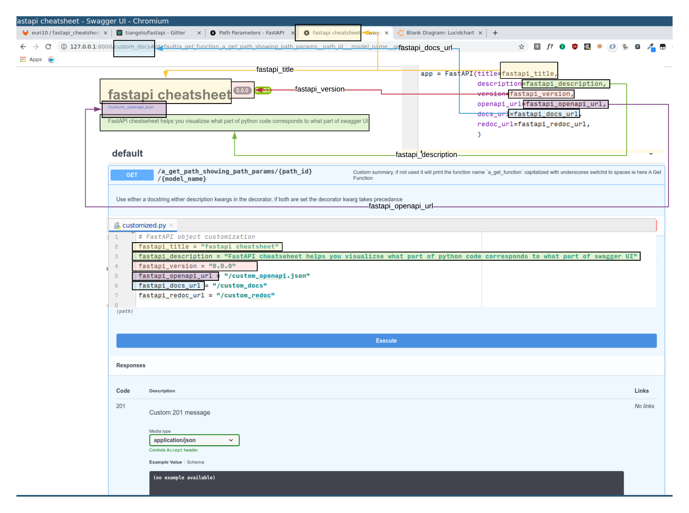
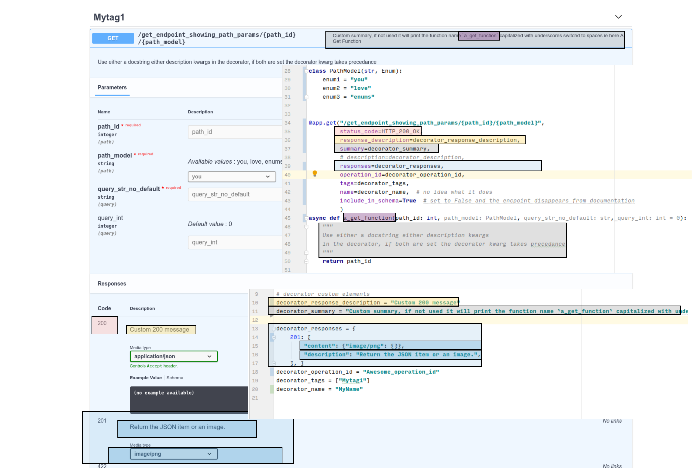
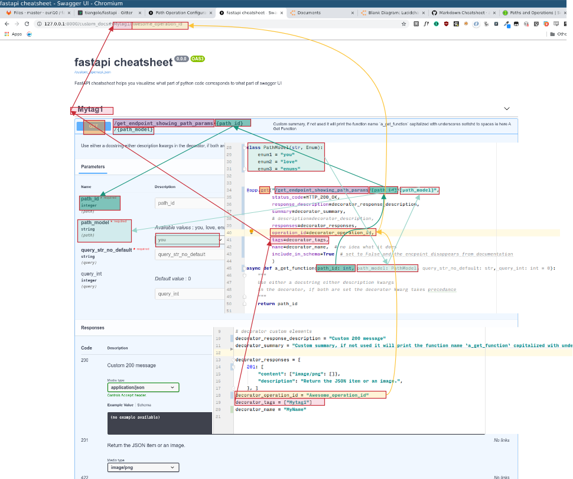

# fastapi_cheatsheet

## why ?

Classic repository question:

> Q: How do you add a description ?

> A: A description to what ?

> Q: To the response

> A: Which one, you can add multiple responses to an endpoint...

> Q: What ? You can do that ? You're insane dude my consumers won't cope with multiple answers, status codes, I'm glad it exists but well, let's say I just want to customize the description for the default status code of that endpoint.

> A: Ok there is a `responses` kwargs in the decorator, that's for the multiple answers
Now for the default status code there is the `response_description` kwarg

Or you could do:

> Check the yellow box with black outline on the [2nd image](https://gitlab.com/euri10/fastapi_cheatsheet/raw/master/FastAPI_cheatsheet_general_endpoint.png), it's how you can do that.

## FastAPI title, description
Generated using LucidChart, save as png with transparent background, 300dpi

You can comment here:

https://www.lucidchart.com/invitations/accept/b36921b1-7ffc-47bd-8487-fb2ca40e1e7e

## FastAPI general swagger endpoint description

You can comment [here](https://www.lucidchart.com/invitations/accept/eef8fb64-0a92-4c23-8d46-181532f41f96
), 1st image, boxes with black outline shows some general endpoints cusomization possible:

## FastAPI path operations

You can comment [here](https://drive.google.com/file/d/1DkJuYFjk4kPSO3Y8EfXCIrhGJOwE-CsZ/view?usp=sharing) boxes with red outline shows how path operations parameters are represented in swagger given the code:

## FastAPI query operations

to be done

## notes to self while doing this on potentially simplifying usage
1. in FastAPI object, pydantic type for `openapi_url`, `docs_url`, `redoc_url` could be stricter and impose having a forward slash imposed.
2. in route decorator, the order of kwargs makes no sense, group them in sensible buckets, ie for instance `status_code` should be with `response_description`
3. in route decorator the kwarg `summary` is not explicit enough imho
4. explain precedance of various elements better in the docs
5. if you set `response_description` there is no way to set a response example, or is there ?

